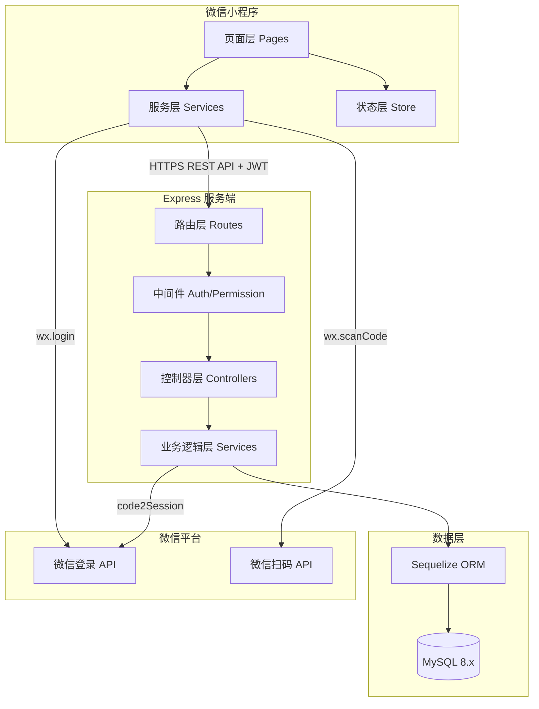
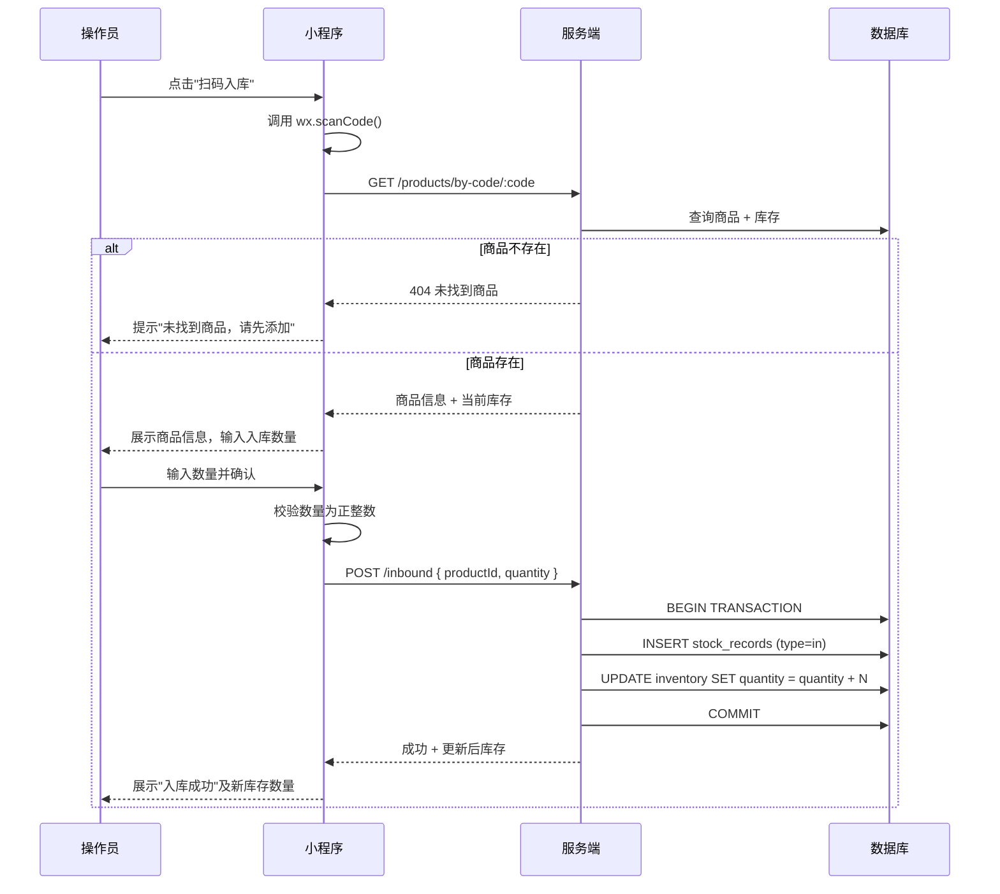
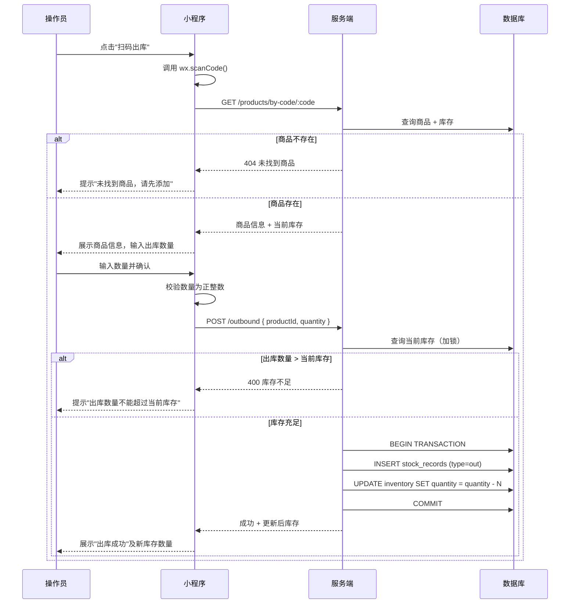

# 技术设计文档

## 概述

智慧店铺微信小程序是一套面向中小型零售店铺的库存管理系统，采用 Monorepo 方式统一管理前后端代码。系统以"店铺"为核心数据隔离单元，支持店主管理多个店铺，操作员通过扫码完成入库/出库，并提供库存查询、出入库记录查询和数据统计可视化功能。

技术栈：
- 前端：Taro 3.x（编译为微信小程序）
- 后端：Express + Node.js（TypeScript）
- 数据库：MySQL 8.x（通过 Sequelize ORM 访问）
- 包管理：pnpm workspace（Monorepo）
- 认证：微信 OpenID + JWT（jsonwebtoken）

---

## 架构

### Monorepo 目录结构

```
smart-shop/
├── package.json                  # 根 package，定义 workspace 脚本
├── pnpm-workspace.yaml           # pnpm workspace 配置
├── .eslintrc.js                  # 统一 ESLint 配置
├── .prettierrc                   # 统一 Prettier 配置
├── tsconfig.base.json            # 共享 TypeScript 基础配置
├── packages/
│   ├── shared/                   # 共享类型定义与工具函数
│   │   ├── package.json
│   │   └── src/
│   │       ├── types/            # 共享 TS 类型（Product, Inventory, Record 等）
│   │       └── utils/            # 共享工具函数（日期格式化、校验等）
│   ├── miniapp/                  # Taro 微信小程序
│   │   ├── package.json
│   │   ├── project.config.json
│   │   └── src/
│   │       ├── app.tsx
│   │       ├── app.config.ts     # 全局路由配置
│   │       ├── pages/            # 页面目录（见前端路由章节）
│   │       ├── components/       # 公共组件
│   │       ├── services/         # API 请求封装
│   │       ├── store/            # 全局状态（Zustand 或 Taro 内置）
│   │       └── utils/
│   └── server/                   # Express 后端服务
│       ├── package.json
│       └── src/
│           ├── app.ts            # Express 入口
│           ├── config/           # 数据库、JWT 等配置
│           ├── models/           # Sequelize 模型
│           ├── routes/           # 路由定义
│           ├── controllers/      # 控制器
│           ├── services/         # 业务逻辑层
│           ├── middlewares/      # 认证、权限、错误处理中间件
│           └── utils/
└── docs/
    └── design.md
```

### 系统架构图



---

## 组件与接口

### 后端模块划分

| 模块 | 路由前缀 | 职责 |
|------|----------|------|
| 认证模块 | `/api/auth` | 微信登录、JWT 签发与刷新 |
| 店铺模块 | `/api/shops` | 店铺 CRUD、店铺成员管理 |
| 商品模块 | `/api/shops/:shopId/products` | 商品 CRUD、编码查询 |
| 库存模块 | `/api/shops/:shopId/inventory` | 库存查询、预警查询 |
| 入库模块 | `/api/shops/:shopId/inbound` | 入库操作、入库记录查询 |
| 出库模块 | `/api/shops/:shopId/outbound` | 出库操作、出库记录查询 |
| 记录模块 | `/api/shops/:shopId/records` | 出入库记录联合查询、分页 |
| 统计模块 | `/api/shops/:shopId/statistics` | 汇总指标、趋势图数据、分类占比 |

### 中间件链

```
请求 → authenticateJWT → verifyShopAccess → [roleGuard] → Controller
```

- `authenticateJWT`：验证 JWT，解析 userId 和 role 注入 `req.user`
- `verifyShopAccess`：校验 `req.params.shopId` 归属于当前用户
- `roleGuard(roles)`：可选，限制特定角色（如仅 owner 可访问统计）

### API 接口设计

#### 认证

```
POST /api/auth/login
Body: { code: string }          // 微信 wx.login 返回的 code
Response: { token: string, user: { id, role, nickname } }
```

#### 店铺

```
GET    /api/shops                          // 获取当前用户的店铺列表
POST   /api/shops                          // 创建店铺
GET    /api/shops/:shopId                  // 获取店铺详情
PUT    /api/shops/:shopId                  // 修改店铺名称
GET    /api/shops/:shopId/members          // 获取店铺成员列表
POST   /api/shops/:shopId/members          // 邀请操作员
DELETE /api/shops/:shopId/members/:userId  // 移除成员
```

#### 商品

```
GET    /api/shops/:shopId/products                    // 商品列表（支持 ?keyword=&category=）
POST   /api/shops/:shopId/products                    // 新建商品
GET    /api/shops/:shopId/products/:productId         // 商品详情
PUT    /api/shops/:shopId/products/:productId         // 修改商品
GET    /api/shops/:shopId/products/by-code/:code      // 按编码查询商品（扫码用）
```

#### 库存

```
GET /api/shops/:shopId/inventory                      // 库存列表（支持 ?keyword=&category=&alert=true）
PUT /api/shops/:shopId/inventory/:productId/threshold // 设置预警阈值
```

#### 入库 / 出库

```
POST /api/shops/:shopId/inbound
Body: { productId, quantity, remark? }
Response: { record, updatedInventory }

POST /api/shops/:shopId/outbound
Body: { productId, quantity, remark? }
Response: { record, updatedInventory }
```

#### 出入库记录

```
GET /api/shops/:shopId/records
Query: { type?: 'in'|'out', startDate?, endDate?, keyword?, page=1, pageSize=20 }
Response: { total, page, pageSize, list: Record[] }
```

#### 统计

```
GET /api/shops/:shopId/statistics/summary
Response: { todayInbound, todayOutbound, productCount, alertCount }

GET /api/shops/:shopId/statistics/trend
Query: { startDate, endDate }   // 最长 365 天
Response: { dates: string[], inbound: number[], outbound: number[] }

GET /api/shops/:shopId/statistics/category-distribution
Response: { category: string, count: number, percentage: number }[]

GET /api/shops/:shopId/statistics/top-inventory
Response: { productId, name, quantity }[]   // 前 10
```

### 前端页面结构与路由

```
pages/
├── auth/
│   └── login/index.tsx              # 微信登录页
├── shop/
│   ├── list/index.tsx               # 店铺列表（选择/切换店铺）
│   └── create/index.tsx             # 创建/编辑店铺
├── home/
│   └── index.tsx                    # 首页（功能入口，按角色展示）
├── product/
│   ├── list/index.tsx               # 商品列表
│   ├── detail/index.tsx             # 商品详情（含近30条记录）
│   └── edit/index.tsx               # 新建/编辑商品
├── inventory/
│   └── list/index.tsx               # 库存列表（搜索、筛选、预警标注）
├── inbound/
│   └── index.tsx                    # 扫码入库页
├── outbound/
│   └── index.tsx                    # 扫码出库页
├── records/
│   └── list/index.tsx               # 出入库记录列表（分页、筛选）
└── statistics/
    └── index.tsx                    # 数据统计页（仅店主可见）
```

路由配置（`app.config.ts`）：

```typescript
export default {
  pages: [
    'pages/auth/login/index',
    'pages/shop/list/index',
    'pages/shop/create/index',
    'pages/home/index',
    'pages/product/list/index',
    'pages/product/detail/index',
    'pages/product/edit/index',
    'pages/inventory/list/index',
    'pages/inbound/index',
    'pages/outbound/index',
    'pages/records/list/index',
    'pages/statistics/index',
  ],
  window: { navigationBarTitleText: '智慧店铺' },
  tabBar: {
    list: [
      { pagePath: 'pages/home/index', text: '首页' },
      { pagePath: 'pages/inventory/list/index', text: '库存' },
      { pagePath: 'pages/records/list/index', text: '记录' },
      { pagePath: 'pages/statistics/index', text: '统计' },
    ],
  },
}
```

---

## 数据模型

### ER 图

```mermaid
erDiagram
    USER {
        int id PK
        string openid UK
        string nickname
        string avatar_url
        datetime created_at
    }

    SHOP {
        int id PK
        string name
        int owner_id FK
        datetime created_at
        datetime updated_at
    }

    SHOP_MEMBER {
        int id PK
        int shop_id FK
        int user_id FK
        enum role "owner|operator"
        datetime created_at
    }

    PRODUCT {
        int id PK
        int shop_id FK
        string name
        string code UK_per_shop
        string category
        string spec
        string unit
        int alert_threshold
        datetime created_at
        datetime updated_at
    }

    INVENTORY {
        int id PK
        int shop_id FK
        int product_id FK
        int quantity
        datetime updated_at
    }

    STOCK_RECORD {
        int id PK
        int shop_id FK
        int product_id FK
        int operator_id FK
        enum type "in|out"
        int quantity
        int quantity_before
        int quantity_after
        string remark
        datetime created_at
    }

    USER ||--o{ SHOP : "owns"
    SHOP ||--o{ SHOP_MEMBER : "has"
    USER ||--o{ SHOP_MEMBER : "belongs to"
    SHOP ||--o{ PRODUCT : "contains"
    SHOP ||--o{ INVENTORY : "tracks"
    PRODUCT ||--|| INVENTORY : "has"
    SHOP ||--o{ STOCK_RECORD : "records"
    PRODUCT ||--o{ STOCK_RECORD : "referenced by"
    USER ||--o{ STOCK_RECORD : "operated by"
```

### 表结构说明

**users**：存储微信用户信息，`openid` 全局唯一。

**shops**：店铺表，`owner_id` 指向创建该店铺的用户。

**shop_members**：店铺成员关联表，`(shop_id, user_id)` 联合唯一，`role` 为 `owner` 或 `operator`。店主创建店铺时自动插入一条 `role=owner` 的记录。

**products**：商品表，`(shop_id, code)` 联合唯一，确保同一店铺内编码不重复。

**inventory**：库存表，`(shop_id, product_id)` 联合唯一，商品创建时自动初始化 `quantity=0`。

**stock_records**：出入库记录表，记录操作前后库存数量（`quantity_before`、`quantity_after`），便于审计和回溯。`type` 为 `in`（入库）或 `out`（出库）。

### 关键业务流程

#### 扫码入库流程



#### 扫码出库流程



---


## 正确性属性

*属性（Property）是在系统所有合法执行路径中都应成立的特征或行为——本质上是对系统应做什么的形式化陈述。属性是人类可读规范与机器可验证正确性保证之间的桥梁。*

### 属性 1：商品创建 Round-Trip

*对于任意* 合法的商品信息（名称非空、编码非空），在当前店铺下创建商品后，通过返回的 ID 查询该商品，应能得到与创建时相同的名称、编码、规格、单位和分类信息。

**验证需求：1.2**

---

### 属性 2：商品编码唯一性

*对于任意* 已存在于当前店铺的商品编码，再次以相同编码创建商品时，服务端应返回错误，且数据库中该编码的商品记录数量保持为 1。

**验证需求：1.3**

---

### 属性 3：商品字段验证

*对于任意* 商品名称为空白字符串或商品编码为空白字符串的创建/更新请求，服务端应拒绝该请求并返回相应的错误提示，数据库中的商品记录保持不变。

**验证需求：1.5, 1.6**

---

### 属性 4：入库后库存增加

*对于任意* 商品和任意正整数入库数量 N，执行入库操作后，该商品的库存数量应等于入库前的库存数量加上 N，且数据库中存在一条对应的入库记录。

**验证需求：2.3**

---

### 属性 5：出库后库存减少

*对于任意* 商品和任意不超过当前库存的正整数出库数量 N，执行出库操作后，该商品的库存数量应等于出库前的库存数量减去 N，且数据库中存在一条对应的出库记录。

**验证需求：3.3**

---

### 属性 6：操作数量验证

*对于任意* 入库或出库请求中数量字段为非正整数（0、负数、小数、字符串）的情况，服务端应拒绝该请求，库存数量保持不变。

**验证需求：2.6, 3.6**

---

### 属性 7：出库库存不足拒绝

*对于任意* 出库数量大于当前库存数量的出库请求，服务端应返回错误并拒绝操作，库存数量保持不变。

**验证需求：3.5**

---

### 属性 8：库存操作原子性

*对于任意* 入库或出库操作，若数据库写入过程中发生错误，则库存记录和出入库记录均应回滚至操作前的状态，不存在部分写入的情况。

**验证需求：2.7, 3.8**

---

### 属性 9：库存筛选准确性

*对于任意* 关键词搜索或分类筛选请求，返回的库存列表中每条记录的商品名称或编码都应包含该关键词（搜索场景），或每条记录的分类都应等于所选分类（筛选场景）。

**验证需求：4.2, 4.3**

---

### 属性 10：库存预警标记

*对于任意* 库存数量低于预警阈值的商品，库存列表接口返回的该商品记录中应包含预警标记（`isAlert: true`）；库存数量不低于阈值的商品不应有预警标记。

**验证需求：4.4**

---

### 属性 11：记录筛选准确性

*对于任意* 日期范围、操作类型或关键词筛选条件，返回的出入库记录列表中每条记录都应满足所有筛选条件（时间在范围内、类型匹配、名称或编码包含关键词）。

**验证需求：5.2, 5.3, 5.4**

---

### 属性 12：分页大小约束

*对于任意* 分页查询请求，返回的记录数量不应超过 pageSize（默认 20），且 total 字段应等于满足筛选条件的记录总数。

**验证需求：5.5**

---

### 属性 13：统计数据一致性

*对于任意* 店铺，统计接口返回的今日入库总数量应等于数据库中该店铺当日所有入库记录的数量之和；今日出库总数量同理。

**验证需求：6.1**

---

### 属性 14：分类占比之和为 100%

*对于任意* 店铺，分类库存占比接口返回的所有分类的 percentage 之和应等于 100（允许浮点误差 ±0.01）。

**验证需求：6.3**

---

### 属性 15：统计时间范围限制

*对于任意* 自定义时间范围超过 365 天的统计请求，服务端应返回错误并拒绝处理。

**验证需求：6.4**

---

### 属性 16：Top-10 库存排序

*对于任意* 店铺，Top-10 库存接口返回的列表长度不超过 10，且列表按库存数量降序排列（即 list[i].quantity >= list[i+1].quantity）。

**验证需求：6.5**

---

### 属性 17：JWT 包含角色信息

*对于任意* 合法的微信登录请求，服务端返回的 JWT 解码后应包含 userId 和 role 字段，且 role 值为 `owner` 或 `operator`。

**验证需求：7.2**

---

### 属性 18：无效 JWT 返回 401

*对于任意* 携带无效、过期或格式错误 JWT 的请求，服务端应返回 HTTP 401 状态码。

**验证需求：7.5**

---

### 属性 19：店铺创建 Round-Trip

*对于任意* 非空店铺名称，创建店铺后通过返回的 ID 查询，应能得到与创建时相同的名称，且该店铺出现在店主的店铺列表中。

**验证需求：8.2, 8.4**

---

### 属性 20：数据隔离

*对于任意* 用户尝试访问不属于其权限范围内的店铺数据（商品、库存、记录、统计），服务端应返回 HTTP 403 状态码，且不返回任何目标店铺的数据。

**验证需求：8.8, 8.9**

---

## 错误处理

### HTTP 状态码规范

| 状态码 | 场景 |
|--------|------|
| 200 | 请求成功 |
| 201 | 资源创建成功 |
| 400 | 请求参数错误（缺少必填字段、格式错误、未指定店铺） |
| 401 | JWT 无效或过期 |
| 403 | 无权访问目标资源（店铺归属校验失败） |
| 404 | 资源不存在（商品、店铺等） |
| 409 | 资源冲突（商品编码重复） |
| 500 | 服务器内部错误 |

### 统一错误响应格式

```json
{
  "code": "PRODUCT_CODE_EXISTS",
  "message": "商品编码已存在",
  "details": {}
}
```

### 事务处理

入库和出库操作必须在数据库事务中执行，包含以下步骤：
1. 查询当前库存（使用 `SELECT ... FOR UPDATE` 加行锁）
2. 校验业务规则（出库时检查库存充足性）
3. 插入 stock_records 记录
4. 更新 inventory 数量
5. 提交事务；任何步骤失败则回滚

### 前端错误处理

- 网络请求失败：展示"网络异常，请重试"并提供重试按钮
- 401 响应：清除本地 token，跳转至登录页
- 403 响应：展示"无权限访问"提示
- 业务错误（400/409）：直接展示服务端返回的 message 字段

---

## 测试策略

### 双轨测试方法

系统采用单元测试和属性测试相结合的方式，两者互补：
- 单元测试：验证具体示例、边界条件和集成点
- 属性测试：通过随机输入验证普遍性属性，覆盖大量输入组合

### 属性测试配置

后端属性测试使用 **fast-check**（TypeScript/Node.js 的属性测试库）。

每个属性测试至少运行 **100 次迭代**。

每个属性测试必须通过注释标注对应的设计属性：

```typescript
// Feature: smart-shop-wechat-miniapp, Property 4: 入库后库存增加
it('inbound increases inventory by exact quantity', () => {
  fc.assert(
    fc.property(
      fc.integer({ min: 1, max: 10000 }),  // 入库数量
      async (quantity) => {
        // 测试实现
      }
    ),
    { numRuns: 100 }
  )
})
```

### 单元测试重点

- 认证中间件（JWT 验证逻辑）
- 店铺归属校验中间件
- 输入验证逻辑（商品字段、操作数量）
- 统计计算函数（汇总、占比计算）
- 分页逻辑

### 属性测试重点（对应设计属性）

| 属性编号 | 测试文件 | 测试内容 |
|----------|----------|----------|
| 属性 1 | `product.spec.ts` | 商品创建 round-trip |
| 属性 2 | `product.spec.ts` | 编码唯一性 |
| 属性 3 | `product.spec.ts` | 字段验证 |
| 属性 4 | `inbound.spec.ts` | 入库后库存增加 |
| 属性 5 | `outbound.spec.ts` | 出库后库存减少 |
| 属性 6 | `stock.spec.ts` | 操作数量验证 |
| 属性 7 | `outbound.spec.ts` | 库存不足拒绝 |
| 属性 8 | `stock.spec.ts` | 操作原子性 |
| 属性 9 | `inventory.spec.ts` | 库存筛选准确性 |
| 属性 10 | `inventory.spec.ts` | 预警标记 |
| 属性 11 | `records.spec.ts` | 记录筛选准确性 |
| 属性 12 | `records.spec.ts` | 分页大小约束 |
| 属性 13 | `statistics.spec.ts` | 统计数据一致性 |
| 属性 14 | `statistics.spec.ts` | 分类占比之和 |
| 属性 15 | `statistics.spec.ts` | 时间范围限制 |
| 属性 16 | `statistics.spec.ts` | Top-10 排序 |
| 属性 17 | `auth.spec.ts` | JWT 包含角色 |
| 属性 18 | `auth.spec.ts` | 无效 JWT 返回 401 |
| 属性 19 | `shop.spec.ts` | 店铺创建 round-trip |
| 属性 20 | `shop.spec.ts` | 数据隔离 |

### 前端测试

前端使用 **@testing-library/react**（Taro 兼容版本）进行组件测试，重点覆盖：
- 扫码入库/出库页面的数量输入验证
- 库存预警标注的渲染逻辑
- 角色权限控制的页面渲染（操作员 vs 店主）
- 分页加载逻辑
